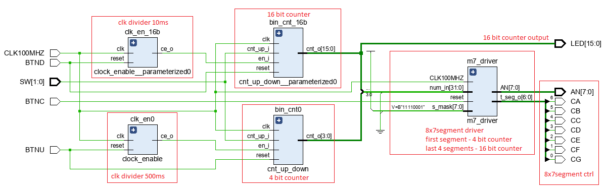

# Digital-electronics-1

## My GitHub repository

[Digital-electronics-1](https://github.com/gkaretka/Digital-electronics-1)

## Lab assignment 5)

### Preparation tasks (using my Nexys 4 DDR):

Calculate how many periods of clock signal with frequency of 100MHz contain time intervals 2ms, 4ms, 10ms, 250ms, 500ms, and 1s. Write values in decimal, binary, and hexadecimal forms.

| **Time interval** | **Number of clk periods** | **Number of clk periods in hex** | **Number of clk periods in binary** |
| :-: | :-: | :-: | :-: |
| 2ms | 200 000 | `x"3_0d40"` | `b"0011_0000_1101_0100_0000"` |
| 4ms | 400 000 | `x"6_1A80"` | `b"0110_0001_1010_1000_0000"` |
| 10ms | 1 000 000 | `x"F_4240"` | `b"1111_0100_0010_0100_0000"` |
| 250ms | 25 000 000 | `x"17D_7840"` | `b"0001_0111_1101_0111_1000_0100_0000"` |
| 500ms | 50 000 000 | `x"2FA_F080"` | `b"0010_1111_1010_1111_0000_1000_0000"` |
| 1sec | 100 000 000 | `x"5F5_E100"` | `b"0101_1111_0101_1110_0001_0000_0000"` |


### Bidirectional counter

#### Bidirectional counter process

```vhdl
p_cnt_up_down : process(clk)
    begin
        if rising_edge(clk) then
            if (reset = '1') then               -- Synchronous reset
                s_cnt_local <= (others => '0'); -- Clear all bits
            elsif (en_i = '1') then       -- Test if counter is enabled
                if (cnt_up_i = '1') then
                    s_cnt_local <= s_cnt_local + 1;
                else
                    s_cnt_local <= s_cnt_local - 1;
                end if;
            end if;
        end if;
    end process p_cnt_up_down;
```

#### TB reset process

```vhdl
--------------------------------------------------------------------
-- Reset generation process
--------------------------------------------------------------------
p_reset_gen : process
begin
    s_reset <= '0';
    wait for 12 ns;
    s_reset <= '1';                 -- Reset activated
    wait for 73 ns;
    s_reset <= '0';
    wait;
end process p_reset_gen;
```

#### TB stimulus process

```vhdl
--------------------------------------------------------------------
-- Data generation process
--------------------------------------------------------------------
p_stimulus : process
begin
    report "Stimulus process started" severity note;

    s_en     <= '1';                -- Enable counting
    s_cnt_up <= '1';
    wait for 380 ns;                -- Change counter direction
    s_cnt_up <= '0';
    wait for 220 ns;
    s_en     <= '0';                -- Disable counting

    report "Stimulus process finished" severity note;
    wait;
end process p_stimulus;
```

#### 4-bit counter whole waveform


#### 4-bit counter closeup waveform (detail on change of counting direction)


### 16-bit and 4-bit counter with 7 segment and LED signalising

```vhdl
----------------------------------------------------------------------------------
-- Company: 
-- Engineer: 
-- 
-- Create Date: 03/10/2021 11:18:46 AM
-- Design Name: 
-- Module Name: top - Behavioral
-- Project Name: 
-- Target Devices: 
-- Tool Versions: 
-- Description: 
-- 
-- Dependencies: 
-- 
-- Revision:
-- Revision 0.01 - File Created
-- Additional Comments:
-- 
----------------------------------------------------------------------------------


library IEEE;
use IEEE.STD_LOGIC_1164.ALL;

-- Uncomment the following library declaration if using
-- arithmetic functions with Signed or Unsigned values
--use IEEE.NUMERIC_STD.ALL;

-- Uncomment the following library declaration if instantiating
-- any Xilinx leaf cells in this code.
--library UNISIM;
--use UNISIM.VComponents.all;

entity top is
    generic(
        g_CNT_WIDTH :   natural := 4;         -- Number of bits for counter
        g_MAX       :   natural := 50000000;  -- Number of clk pulses to generate
        
        g_16B_WIDTH :   natural := 16;        -- Number of bits for 16bit counter
        g_16B_MAX   :   natural := 1000000    -- Number of clk pulses for enable
    );

    Port (
        CLK100MHZ   :   in    std_logic;
        BTNC        :   in    std_logic;
        BTNU        :   in    std_logic;
        BTND        :   in    std_logic;
        
        SW          :   in    std_logic_vector(2 - 1 downto 0);
        LED         :   out   std_logic_vector(16 - 1 downto 0);
        
        CA          :   out std_logic;
        CB          :   out std_logic;
        CC          :   out std_logic;
        CD          :   out std_logic;
        CE          :   out std_logic;
        CF          :   out std_logic;
        CG          :   out std_logic;
        
        AN          :   out std_logic_vector(8 - 1 downto 0)	 
    );
end top;

architecture Behavioral of top is

    -- Internal clock enable
    signal s_en_4b      : std_logic;
    -- Internal counter
    signal s_cnt_4b     : std_logic_vector(4 - 1 downto 0);
    
    signal s_cnt_16b    : std_logic_vector(16 - 1 downto 0);
    signal s_en_16b     : std_logic;
begin

    --------------------------------------------------------------------
    -- 4 bit counter instance
    clk_en0 : entity work.clock_enable
        generic map(
            g_MAX   =>  g_MAX
        )
        
        port map(
            clk     =>  CLK100MHZ,
            reset   =>  BTNU,
            ce_o    =>  s_en_4b
        );
        
    --------------------------------------------------------------------
    -- 4 bit counters clk divider
    bin_cnt0 : entity work.cnt_up_down
        generic map(
            g_CNT_WIDTH =>  g_CNT_WIDTH
        )
        port map(
            clk         =>  CLK100MHZ,
            reset       =>  BTNU,
            en_i        =>  s_en_4b,
            cnt_up_i    =>  SW(0),
            cnt_o       =>  s_cnt_4b
        );
        
    --------------------------------------------------------------------    
    -- 16 bit counter
    clk_en_16b : entity work.clock_enable
        generic map(
            g_MAX   =>  g_16B_MAX
        )
        
        port map(
            clk     =>  CLK100MHZ,
            reset   =>  BTND,
            ce_o    =>  s_en_16b
        );
        
    --------------------------------------------------------------------
    -- Instance (copy) of cnt_up_down entity
    bin_cnt_16b : entity work.cnt_up_down
        generic map(
            g_CNT_WIDTH =>  g_16B_WIDTH
        )
        port map(
            clk         =>  CLK100MHZ,
            reset       =>  BTND,
            en_i        =>  s_en_16b,
            cnt_up_i    =>  SW(1),
            cnt_o       =>  s_cnt_16b
        );

    -- Display input value on LEDs
    LED(15 downto 0) <= s_cnt_16b;

    --------------------------------------------------------------------
    -- Instance m7_driver entity
    -- Drives all 7 segment displays on Nexys 4 DDR
    -- refresing period = 8*1ms = 8ms
    -- input as 32 bits of number       -- num_in
    -- with mask for unused segments    -- s_maks
    m7_driver : entity work.m7_driver
        port map(
            CLK100MHZ   =>  CLK100MHZ,
            reset       =>  BTNC,
            
            num_in(4-1 downto 0)    => s_cnt_4b,
            num_in(16-1 downto 4)   => b"0000_0000_0000",
            num_in(32-1 downto 16)  => s_cnt_16b,
            
            s_mask      => b"1111_0001",
            
            AN          => AN,
            
            t_seg_o(6)  => CA,
            t_seg_o(5)  => CB,
            t_seg_o(4)  => CC,
            t_seg_o(3)  => CD,
            t_seg_o(2)  => CE,
            t_seg_o(1)  => CF,
            t_seg_o(0)  => CG
        );

end architecture Behavioral;
```

### 16-bit and 4-bit counter flow chart



### Test on my Nexys 4 DDR

[](http://www.youtube.com/watch?v=TLhBoTNzqtU "Test on my Nexys 4 DDR")
