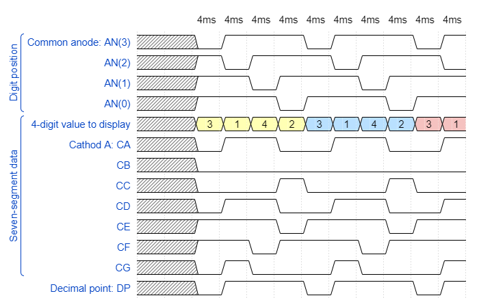
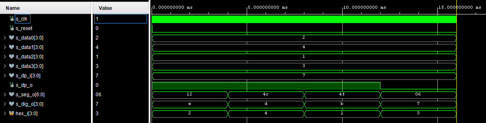
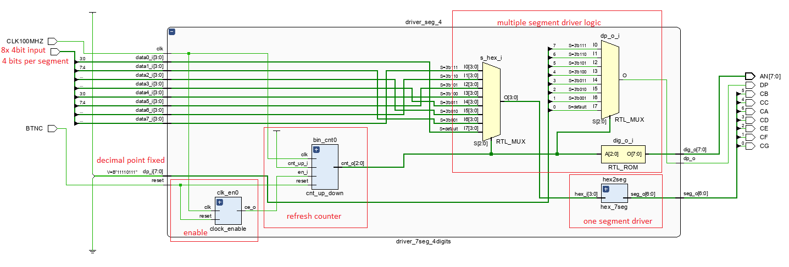

# Digital-electronics-1

## My GitHub repository

[Digital-electronics-1](https://github.com/gkaretka/Digital-electronics-1)

### Preparation tasks:



```js
{
  signal:
  [
    ['Digit position',
      {name: 'Common anode: AN(3)', wave: 'xx01..01..01'},
      {name: 'AN(2)', wave: 'xx101..01..0'},
      {name: 'AN(1)', wave: 'xx1.01..01..'},
      {name: 'AN(0)', wave: 'xx1..01..01.'},
    ],
    ['Seven-segment data',
      {name: '4-digit value to display', wave: 'xx3333555599', data: ['3','1','4','2','3','1','4','2','3','1']},
      {name: 'Cathod A: CA', wave: 'xx01.0.1.0.1'},
      {name: 'CB', wave: 'xx0.........'},
      {name: 'CC', wave: 'xx0..10..10.'},
      {name: 'CD', wave: 'xx01.0.1.0.1'},
      {name: 'CE', wave: 'xx1..01..01.'},
      {name: 'CF', wave: 'xx1.01..01..'},
      {name: 'CG', wave: 'xx010..10..1'},
    ],
    {name: 'Decimal point: DP', wave: 'xx01..01..01'},
  ],
  head:
  {
    text: '                    4ms   4ms   4ms   4ms   4ms   4ms   4ms   4ms   4ms   4ms',
  },
}
```

### Disaply driver

#### Display driver mux

```vhdl
p_mux : process(s_cnt, data0_i, data1_i, data2_i, data3_i, dp_i)
    begin
        case s_cnt is
            when "11" =>
                s_hex <= data3_i;
                dp_o  <= dp_i(3);
                dig_o <= "0111";

            when "10" =>
                s_hex <= data2_i;
                dp_o  <= dp_i(2);
                dig_o <= "1011";

            when "01" =>
                s_hex <= data1_i;
                dp_o  <= dp_i(1);
                dig_o <= "1101";

            when others =>
                s_hex <= data0_i;
                dp_o  <= dp_i(0);
                dig_o <= "1110";
        end case;
    end process p_mux;
```

#### Dispaly driver testbench with asserts

```vhdl
----------------------------------------------------------------------------------
-- Company: 
-- Engineer: 
-- 
-- Create Date: 03/17/2021 10:49:01 AM
-- Design Name: 
-- Module Name: tb_driver_7seg_4digits - Behavioral
-- Project Name: 
-- Target Devices: 
-- Tool Versions: 
-- Description: 
-- 
-- Dependencies: 
-- 
-- Revision:
-- Revision 0.01 - File Created
-- Additional Comments:
-- 
----------------------------------------------------------------------------------


library IEEE;
use IEEE.STD_LOGIC_1164.ALL;

-- Uncomment the following library declaration if using
-- arithmetic functions with Signed or Unsigned values
--use IEEE.NUMERIC_STD.ALL;

-- Uncomment the following library declaration if instantiating
-- any Xilinx leaf cells in this code.
--library UNISIM;
--use UNISIM.VComponents.all;

entity tb_driver_7seg_4digits is
--  Port ( );
end tb_driver_7seg_4digits;

architecture Behavioral of tb_driver_7seg_4digits is

    constant c_CLK_100MHZ_PERIOD : time    := 10 ns;

    signal s_clk : std_logic;
    signal s_reset : std_logic;
    
    signal s_data0 : std_logic_vector(4-1 downto 0);
    signal s_data1 : std_logic_vector(4-1 downto 0);
    signal s_data2 : std_logic_vector(4-1 downto 0);
    signal s_data3 : std_logic_vector(4-1 downto 0);

    signal s_dp_i : std_logic_vector(4-1 downto 0);
    signal s_dp_o : std_logic;
    
    signal s_seg_o : std_logic_vector(7-1 downto 0);
    
    signal s_dig_o : std_logic_vector(4-1 downto 0);
begin

    uut_driver_7seg_4digits : entity work.driver_7seg_4digits
    port map(
        clk     => s_clk,
        reset   => s_reset,
        
        -- 4-bit input values for individual digits
        data0_i => s_data0,
        data1_i => s_data1,
        data2_i => s_data2,
        data3_i => s_data3,
        -- 4-bit input value for decimal points
        dp_i    => s_dp_i,
        -- Decimal point for specific digit
        dp_o    => s_dp_o,
        -- Cathode values for individual segments
        seg_o   => s_seg_o,
        -- Common anode signals to individual displays
        dig_o   => s_dig_o
    );
    
    --------------------------------------------------------------------
    -- Clock generation process
    --------------------------------------------------------------------
    p_clk_gen : process
    begin
        while now < 16 ms loop         -- 75 periods of 100MHz clock
            s_clk <= '0';
            wait for c_CLK_100MHZ_PERIOD / 2;
            s_clk <= '1';
            wait for c_CLK_100MHZ_PERIOD / 2;
        end loop;
        wait;
    end process p_clk_gen;

    --------------------------------------------------------------------
    -- Reset generation process
    --------------------------------------------------------------------
    p_reset_gen : process
    begin
        s_reset <= '0';
        wait for 12 ns;
        s_reset <= '1';                 -- Reset activated
        wait for 73 ns;
        s_reset <= '0';
        wait;
    end process p_reset_gen;
    
    p_stimulus: process
    begin
        -- Report a note at the begining of stimulus process
        report "Stimulus process started. ---------------------------------------" severity note;
        
        -- dispaly number 3.142
        s_data3 <= "0011"; -- store 3 to 4
        s_data2 <= "0001"; -- store 1 to 3
        s_data1 <= "0100"; -- store 4 to 2
        s_data0 <= "0010"; -- store 2 to 1
        
        s_dp_i  <= "0111"; -- decimal point only for the first one
        
        
        wait for 500 us; -- wait for transitions to go away                
        -- assert segment digit = 2
        assert(s_seg_o = "0010010")
        report "First segment wrong digit." severity note;
        
        wait for 4 ms;   
        -- assert segment digit = 4
        assert(s_seg_o = "1001100")
        report "Second segment wrong digit." severity note;
        
        wait for 4 ms;   
        -- assert segment digit = 1
        assert(s_seg_o = "1001111")
        report "Third segment wrong digit." severity note;
        
        wait for 4 ms;   
        -- assert decimal point
        assert(s_dp_o = '0')
        report "Decimal point on wrong digit." severity note;
        -- assert segment digit = 3
        assert(s_seg_o = "0000110")
        report "Last segment wrong digit." severity note;
        
        -- Report a note at the end of stimulus process
        report "Stimulus process finished. ---------------------------------------" severity note;
        wait;
    end process p_stimulus;


end Behavioral;
```



#### Top module architecture

```vhdl
architecture Behavioral of top is
begin
    --------------------------------------------------------------------
    -- Instance (copy) of driver_7seg_4digits entity
    driver_seg_4 : entity work.driver_7seg_4digits
        port map(
            clk         => CLK100MHZ,
            reset       => BTNC,
            
            data0_i(3)  => SW(3),
            data0_i(2)  => SW(2),
            data0_i(1)  => SW(1),
            data0_i(0)  => SW(0),
            
            data1_i(3)  => SW(7),
            data1_i(2)  => SW(6),
            data1_i(1)  => SW(5),
            data1_i(0)  => SW(4),
            
            data2_i(3)  => SW(11),
            data2_i(2)  => SW(10),
            data2_i(1)  => SW(9),
            data2_i(0)  => SW(8),
            
            data3_i(3)  => SW(15),
            data3_i(2)  => SW(14),
            data3_i(1)  => SW(13),
            data3_i(0)  => SW(12),
            
            seg_o(6)    => CA,
            seg_o(5)    => CB,
            seg_o(4)    => CC,
            seg_o(3)    => CD,
            seg_o(2)    => CE,
            seg_o(1)    => CF,
            seg_o(0)    => CG,
            
            dig_o(0)    => AN(0),
            dig_o(1)    => AN(1),
            dig_o(2)    => AN(2),
            dig_o(3)    => AN(3),

            dp_i        => "0111",
            dp_o        => DP
        );

    -- Disconnect the top four digits of the 7-segment display
    AN(7 downto 4) <= b"1111";

end architecture Behavioral;
```



### Test off this task on my Nexys 4 DDR (display 3.142)

[](http://www.youtube.com/watch?v=V2Tf9NELBbA "Test on my Nexys 4 DDR")

### Test on my Nexys 4 DDR (last task, two counters)

[](http://www.youtube.com/watch?v=TLhBoTNzqtU "Test on my Nexys 4 DDR")
