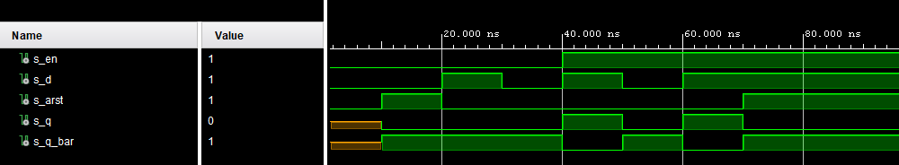
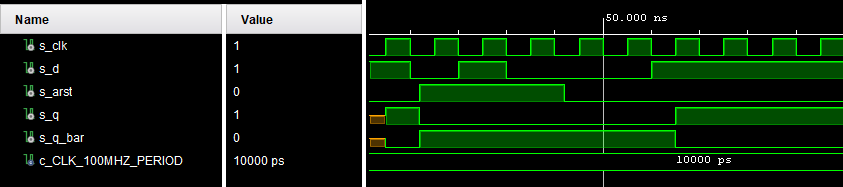
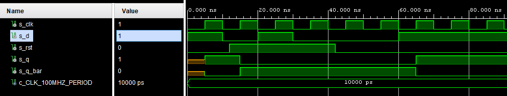
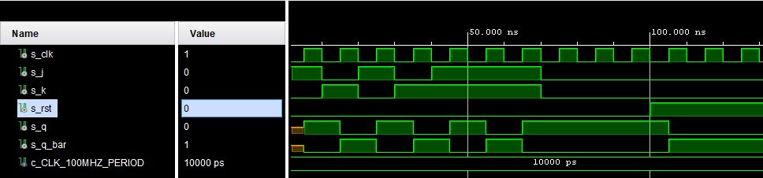
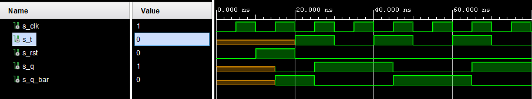
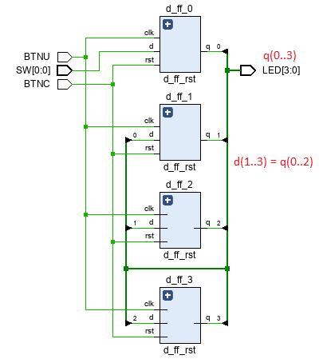

# Digital-electronics-1

## My GitHub repository

[Digital-electronics-1](https://github.com/gkaretka/Digital-electronics-1)

### Preparation tasks:

Write characteristic equations and complete truth tables for D, JK, T flip-flops.

   ```verilog
   D flip flop: q_(n+1) = d
   JK flip flop: q_(n+1) = j * (not q_n) + (not k) * q_n
   T flip flop: q_(n+1) = t * (not q_n) + (not t) * q_n
   ```

   | **D** | **Qn** | **Q(n+1)** | **Comments** |
   | :-: | :-: | :-: | :-- |
   | 0 | 0 | 0 | No change |
   | 0 | 1 | 0 | Change |
   | 1 | 1 | 1 | No change |
   | 1 | 0 | 1 | Change |

   | **J** | **K** | **Qn** | **Q(n+1)** | **Comments** |
   | :-: | :-: | :-: | :-: | :-- |
   | 0 | 0 | 0 | 0 | No change |
   | 0 | 0 | 1 | 1 | No change |
   | 0 | 1 | 0 | 0 | Reset |
   | 0 | 1 | 1 | 0 | Reset |
   | 1 | 0 | 0 | 1 | Set |
   | 1 | 0 | 1 | 1 | Set |
   | 1 | 1 | 0 | 1 | Toggle |
   | 1 | 1 | 1 | 0 | Toggle |

   | **T** | **Qn** | **Q(n+1)** | **Comments** |
   | :-: | :-: | :-: | :-- |
   | 0 | 0 | 0 | No change |
   | 0 | 1 | 1 | No change |
   | 1 | 0 | 1 | Toggle |
   | 1 | 1 | 0 | Toggle |

### D-latch

#### VHDL process code

```vhdl
p_d_latch : process(en, d, arst)
    begin
        if (arst = '1') then
            q       <= '0';
            q_bar   <= '1';
        elsif (en = '1') then
            q       <= d;
            q_bar   <= not d;
        end if;
    end process p_d_latch;
```

#### Testbench

```vhdl
    p_stimulus : process
    begin
        -- Report a note at the begining of stimulus process
        report "Stimulus process started. ---------------------------------------" severity note;
        
        s_en    <=  '0';
        s_arst  <=  '0';
        s_d     <=  '0'; 
        wait for 10 ns; -- no output defined
        s_arst  <=  '1'; -- async reset
        wait for 10 ns;
        s_arst  <=  '0'; -- async reset
        
        -- Test en = 0
        s_d     <=  '1';
        wait for 10ns;
        assert (s_q = '0' and s_q_bar = '1') report "Failed 1" severity note;
        
        s_d     <=  '0';
        wait for 10ns;
        assert (s_q = '0' and s_q_bar = '1') report "Failed 2" severity note;
        
        -- Test en = 1
        s_en    <=  '1';
        s_d     <=  '1';
        wait for 10ns;
        assert (s_q = '1' and s_q_bar = '0') report "Failed 3" severity note;
       
        s_en    <=  '1';
        s_d     <=  '0';
        wait for 10ns;
        assert (s_q = '0' and s_q_bar = '1') report "Failed 4" severity note;
        
        -- Test en=1 arst=1
        s_en    <=  '1';
        s_d     <=  '1';
        wait for 10ns;
        s_arst  <=  '1';
        assert (s_q = '0' and s_q_bar = '1') report "Failed 5" severity note;
        
        report "Stimulus process end. ---------------------------------------" severity note;
        wait;
    end process p_stimulus;
```



### D flip-flop (with async reset)

#### VHDL process code

```vhdl
 p_d_ff_arst : process(clk, arst)
    begin
        if (arst = '1') then
            q       <= '0';
            q_bar   <= '1';
        elsif rising_edge(clk) then
            q       <= d;
            q_bar   <= not d;
        end if;
    end process p_d_ff_arst;
```

#### Testbench (reset process and stimulus)

```vhdl
   --------------------------------------------------------------------
    -- Reset generation process
    --------------------------------------------------------------------
    p_reset_gen : process
    begin
        s_arst <= '0';
        wait for 12 ns;
        s_arst <= '1';                 -- Reset activated
        wait for 30 ns;
        s_arst <= '0';
        wait;
    end process p_reset_gen;

    p_stimulus : process
    begin
        -- Report a note at the begining of stimulus process
        report "Stimulus process started. ---------------------------------------" severity note;
        s_d     <=  '1';
        wait for 10ns;
        assert (s_q = '0' and s_q_bar = '1') report "Failed 1" severity note;
        
        s_d     <=  '0';
        wait for 10ns;
        assert (s_q = '0' and s_q_bar = '1') report "Failed 2" severity note;
        
        s_d     <=  '1';
        wait for 10ns;
        assert (s_q = '1' and s_q_bar = '0') report "Failed 3" severity note;
       
        s_d     <=  '0';
        wait for 10ns;
        assert (s_q = '0' and s_q_bar = '1') report "Failed 4" severity note;
        
        wait for 20ns;
        s_d     <=  '1';
        wait for 10ns;
        assert (s_q = '0' and s_q_bar = '1') report "Failed 5" severity note;
        
        report "Stimulus process ended. ---------------------------------------" severity note;
        wait;
    end process p_stimulus;
```



### D flip-flop (with sync reset)

#### VHDL process code

```vhdl
    p_d_ff_arst : process(clk)
    begin        
        if rising_edge(clk) then
            if (rst = '1') then
                q       <= '0';
                q_bar   <= '1';
            else
                q       <= d;
                q_bar   <= not d;
            end if;
        end if;
    end process p_d_ff_arst;
```

#### Testbench (reset process and stimulus)

```vhdl
--------------------------------------------------------------------
    -- Clock generation process
    --------------------------------------------------------------------
    p_clk_gen : process
    begin
        while now < 750 ns loop         -- 75 periods of 100MHz clock
            s_clk <= '0';
            wait for c_CLK_100MHZ_PERIOD / 2;
            s_clk <= '1';
            wait for c_CLK_100MHZ_PERIOD / 2;
        end loop;
        wait;
    end process p_clk_gen;
    
    --------------------------------------------------------------------
    -- Reset generation process
    --------------------------------------------------------------------
    p_reset_gen : process
    begin
        s_arst <= '0';
        wait for 12 ns;
        s_arst <= '1';                 -- Reset activated
        wait for 30 ns;
        s_arst <= '0';
        wait;
    end process p_reset_gen;

    p_stimulus : process
    begin
        -- Report a note at the begining of stimulus process
        report "Stimulus process started. ---------------------------------------" severity note;
        s_d     <=  '1';
        wait for 10ns;
        assert (s_q = '1' and s_q_bar = '0') report "Failed 1" severity note;
        
        s_d     <=  '0';
        wait for 10ns;
        assert (s_q = '0' and s_q_bar = '1') report "Failed 2" severity note;
        
        s_d     <=  '1';
        wait for 10ns;
        assert (s_q = '0' and s_q_bar = '1') report "Failed 3" severity note;
       
        s_d     <=  '0';
        wait for 10ns;
        assert (s_q = '0' and s_q_bar = '1') report "Failed 4" severity note;
        
        wait for 20ns;
        s_d     <=  '1';
        wait for 25ns;
        assert (s_q = '1' and s_q_bar = '0') report "Failed 5" severity note;
        
        report "Stimulus process ended. ---------------------------------------" severity note;
        wait;
    end process p_stimulus;
```



### JK flip-flop (sync reset)

#### VHDL architecture code

```vhdl
architecture Behavioral of jk_ff_rst is
    signal  s_q     :   STD_LOGIC;
    signal  s_q_bar :   STD_LOGIC;
begin
    
   jk_ff_rst : process(clk)
   begin
        if rising_edge(clk) then
            if (rst = '1') then
                s_q         <=  '0';
                s_q_bar     <=  '1'; 
             else
                if (j = '0' and k = '0') then -- no change
                    s_q     <=  s_q;
                    s_q_bar <=  s_q_bar;
                elsif (j = '0' and k = '1') then -- reset
                    s_q     <=  '0';
                    s_q_bar <=  '1';
                elsif (j = '1' and k = '0') then -- set
                    s_q     <=  '1';
                    s_q_bar <=  '0';
                else -- toggle (1, 1)
                    s_q     <=  not s_q;
                    s_q_bar <=  not s_q_bar;
                end if;
             end if;
        end if;
   end process jk_ff_rst;

   q       <=  s_q;
   q_bar   <=  s_q_bar;
   end Behavioral;
```
#### Testbench (reset process and stimulus)

```vhdl
    --------------------------------------------------------------------
    -- Reset generation process
    --------------------------------------------------------------------
    p_reset_gen : process
    begin
        s_rst   <= '0';
        wait for 100 ns;
        s_rst   <= '1';                 -- Reset activated
        wait for 80 ns;
        s_rst   <= '0';
        wait;
    end process p_reset_gen;

    p_stimulus : process
    begin
        -- Report a note at the begining of stimulus process
        report "Stimulus process started. ---------------------------------------" severity note;
        
        -- Set 1
        s_j <=  '1';
        s_k <=  '0'; 
        wait for 10ns;
        assert (s_q = '1' and s_q_bar = '0') report "Failed 1" severity note;
        
        -- Reset 1
        s_j <=  '0';
        s_k <=  '1';
        wait for 10ns;
        assert (s_q = '0' and s_q_bar = '1') report "Failed 2" severity note;
                
        -- Set 2
        s_j <=  '1';
        s_k <=  '0';
        wait for 10ns;
        assert (s_q = '1' and s_q_bar = '0') report "Failed 3" severity note;
        
        -- Reset 2
        s_j <=  '0';
        s_k <=  '1';    
        wait for 10ns;
        assert (s_q = '0' and s_q_bar = '1') report "Failed 4" severity note;
        
        -- Toggle 1
        s_j <=  '1';
        s_k <=  '1';
        wait for 10ns;
        assert (s_q = '1' and s_q_bar = '0') report "Failed 5" severity note;
        
        -- Toggle 2
        s_j <=  '1';
        s_k <=  '1';
        wait for 10ns;
        assert (s_q = '0' and s_q_bar = '1') report "Failed 6" severity note;
        
        -- Toggle 3
        s_j <=  '1';
        s_k <=  '1';
        wait for 10ns;        
        assert (s_q = '1' and s_q_bar = '0') report "Failed 7" severity note;
        
        -- No change 1
        s_j <=  '0';
        s_k <=  '0';
        wait for 10ns;
        assert (s_q = '1' and s_q_bar = '0') report "Failed 8" severity note;
        
        report "Stimulus process ended. ---------------------------------------" severity note;
        wait;
    end process p_stimulus;
```


### T flip-flop (wtih sync reset)

#### VHDL architecture code

```vhdl
architecture Behavioral of t_ff_rst is
    signal  s_q     :   STD_LOGIC;
    signal  s_q_bar :   STD_LOGIC;
begin

    t_ff_rst : process(clk)
    begin
        if rising_edge(clk) then
            if (rst = '1') then
                s_q         <=  '0';
                s_q_bar     <=  '1'; 
             else
                if (t = '0') then
                    s_q     <=  s_q;
                    s_q_bar <=  s_q_bar;
                else -- toggle (1)
                    s_q     <=  not s_q;
                    s_q_bar <=  not s_q_bar;
                end if;
             end if;
        end if;
    end process t_ff_rst;

    q       <=  s_q;
    q_bar   <=  s_q_bar;
end Behavioral;
```

#### Testbench (reset process and stimulus)

```vhdl
    --------------------------------------------------------------------
    -- Reset generation process
    --------------------------------------------------------------------
    p_reset_gen : process
    begin
        s_rst   <= '0';
        wait for 10 ns;
        s_rst   <= '1';                 -- Reset activated
        wait for 10 ns;
        s_rst   <= '0';
        wait;
    end process p_reset_gen;

    p_stimulus : process
    begin
        -- Report a note at the begining of stimulus process
        report "Stimulus process started. ---------------------------------------" severity note;
        
        wait for 20 ns;
        s_t <=  '1';
        wait for 10ns;
        assert (s_q = '1' and s_q_bar = '0') report "Failed 1" severity note;
        
        s_t <=  '0';
        wait for 10ns;
        assert (s_q = '1' and s_q_bar = '0') report "Failed 2" severity note;

        s_t <=  '1';
        wait for 10ns;
        assert (s_q = '0' and s_q_bar = '1') report "Failed 3" severity note;
        
        s_t <=  '0';
        wait for 10ns;
        assert (s_q = '0' and s_q_bar = '1') report "Failed 4" severity note;
        
        s_t <=  '1';
        wait for 10ns;
        assert (s_q = '1' and s_q_bar = '0') report "Failed 5" severity note;
        
        s_t <=  '0';
        wait for 10ns;
        assert (s_q = '1' and s_q_bar = '0') report "Failed 6" severity note;
        
        report "Stimulus process ended. ---------------------------------------" severity note;
        wait;
    end process p_stimulus;
```



### Shift register using D flip-flops (wtih sync reset)



### Test on my Nexys 4 DDR

I used BTNU directly as a clock source. This is highly discouraged but in this example for demonstation pourpouses is tolerated. Proper way would be to sample BTNU with clock (and using some deglitch/debounce algorithm) but this would require flip flop code to be modified. This is also the main source of glitches you can see in the video.

[](http://www.youtube.com/watch?v=IWPyYpp15K4 "Test on my Nexys 4 DDR")
