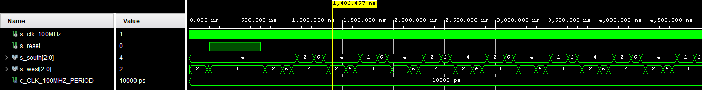

# Digital-electronics-1

## My GitHub repository

[Digital-electronics-1](https://github.com/gkaretka/Digital-electronics-1)

### Preparation tasks:

Read the article [Implementing a Finite State Machine in VHDL](https://www.allaboutcircuits.com/technical-articles/implementing-a-finite-state-machine-in-vhdl/) (parts **A Bit of Background** and **The Finite State Machine**) and understand what an FSM is.

Fill in the table with the state names and output values accoding to the given inputs. Let the reset has just been applied.

| **Input P** | `0` | `0` | `1` | `1` | `0` | `1` | `0` | `1` | `1` | `1` | `1` | `0` | `0` | `1` | `1` | `1` |
| :-- | :-: | :-: | :-: | :-: | :-: | :-: | :-: | :-: | :-: | :-: | :-: | :-: | :-: | :-: | :-: | :-: |
| **Clock** |  |  |  |  |  |  |  |  |  |  |  |  |  |  |  |  |
| **State** | A | A | B | C | C | D | A | B | C | D | B | B | B | C | D | B |
| **Output R** | `0` | `0` | `0` | `0` | `0` | `1` | `0` | `0` | `0` | `1` | `0` | `0` | `0` | `0` | `1` | `0` |

See schematic or reference manual of the Nexys board and find out the connection of two RGB LEDs. How you can control them to get red, yellow, or green colors?


### 2) Traffic light controller

```vhdl
    p_traffic_fsm : process(clk)
    begin
        if rising_edge(clk) then
            if (reset = '1') then       -- Synchronous reset
                s_state <= STOP1 ;      -- Set initial state
                s_cnt   <= std_logic_vector(c_ZERO);      -- Clear all bits

            elsif (s_en = '1') then
                -- Every 250 ms, CASE checks the value of the s_state 
                -- variable and changes to the next state according 
                -- to the delay value.
                case s_state is

                    -- If the current state is STOP1, then wait 1 sec
                    -- and move to the next GO_WAIT state.
                    when STOP1 =>
                        -- Count up to c_DELAY_1SEC
                        if (unsigned(s_cnt) < c_DELAY_1SEC) then
                            s_cnt <= std_logic_vector(unsigned(s_cnt) + 1);
                        else
                            -- Move to the next state
                            s_state <= WEST_GO;
                            -- Reset local counter value
                            s_cnt   <= std_logic_vector(c_ZERO);
                        end if;

                    when WEST_GO =>
                        if (unsigned(s_cnt) < c_DELAY_4SEC) then
                            s_cnt <= std_logic_vector(unsigned(s_cnt) + 1);
                        else
                            s_state <= WEST_WAIT;
                            s_cnt   <= std_logic_vector(c_ZERO);
                        end if;
                        
                    when WEST_WAIT =>
                        if (unsigned(s_cnt) < c_DELAY_2SEC) then
                            s_cnt <= std_logic_vector(unsigned(s_cnt) + 1);
                        else
                            s_state <= STOP2;
                            s_cnt   <= std_logic_vector(c_ZERO);
                        end if;
                        
                    when STOP2 =>
                        if (unsigned(s_cnt) < c_DELAY_1SEC) then
                            s_cnt <= std_logic_vector(unsigned(s_cnt) + 1);
                        else
                            s_state <= SOUTH_GO;
                            s_cnt   <= std_logic_vector(c_ZERO);
                        end if;
                        
                    when SOUTH_GO =>
                        if (unsigned(s_cnt) < c_DELAY_4SEC) then
                            s_cnt <= std_logic_vector(unsigned(s_cnt) + 1);
                        else
                            s_state <= SOUTH_WAIT;
                            s_cnt   <= std_logic_vector(c_ZERO);
                        end if;
                        
                    when SOUTH_WAIT =>
                        if (unsigned(s_cnt) < c_DELAY_2SEC) then
                            s_cnt <= std_logic_vector(unsigned(s_cnt) + 1);
                        else
                            s_state <= STOP1;
                            s_cnt   <= std_logic_vector(c_ZERO);
                        end if;
                    
                    -- It is a good programming practice to use the 
                    -- OTHERS clause, even if all CASE choices have 
                    -- been made. 
                    when others =>
                        s_state <= STOP1;

                end case;
            end if; -- Synchronous reset
        end if; -- Rising edge
    end process p_traffic_fsm;

    p_output_fsm : process(s_state)
    begin
        case s_state is
            when STOP1 =>
                south_o <= "100";   -- Red (RGB = 100)
                west_o  <= "100";   -- Red (RGB = 100)
                
            when WEST_GO =>
                south_o <= "100";   -- Red (RGB = 100)
                west_o  <= "010";   -- Red (RGB = 010)
                
            when WEST_WAIT =>
                south_o <= "100";   -- Red (RGB = 100)
                west_o  <= "110";   -- Red (RGB = 110)
            
            when STOP2 =>
                south_o <= "100";   -- Red (RGB = 100)
                west_o  <= "100";   -- Red (RGB = 100)
                
            when SOUTH_GO =>
                south_o <= "010";   -- Red (RGB = 010)
                west_o  <= "100";   -- Red (RGB = 100)
                
            when SOUTH_WAIT =>
                south_o <= "110";   -- Red (RGB = 110)
                west_o  <= "100";   -- Red (RGB = 100)                

            when others =>
                south_o <= "100";   -- Red
                west_o  <= "100";   -- Red
        end case;
    end process p_output_fsm;
```




### Smart traffic light


Input data:
counter_enable, sensor_west, sensor_south


```vhdl
p_traffic_fsm : process(clk)
    begin
        if rising_edge(clk) then
            if (reset = '1') then       -- Synchronous reset
                s_state <= STOP1 ;      -- Set initial state
                s_cnt   <= std_logic_vector(c_ZERO);      -- Clear all bits

            elsif (s_en = '1') then
                -- Every 250 ms, CASE checks the value of the s_state 
                -- variable and changes to the next state according 
                -- to the delay value.
                case s_state is
                    -- If the current state is STOP1, then wait 1 sec
                    -- and move to the next GO_WAIT state.
                    when STOP1 =>
                        -- Count up to c_DELAY_1SEC
                        if (unsigned(s_cnt) < c_DELAY_1SEC) then
                            s_cnt <= std_logic_vector(unsigned(s_cnt) + 1);
                        else
                            -- Move to the next state
                            s_state <= WEST_GO;
                            -- Reset local counter value
                            s_cnt   <= std_logic_vector(c_ZERO);
                        end if;

                    when WEST_GO =>
                        if (unsigned(s_cnt) < c_DELAY_4SEC) then
                            s_cnt <= std_logic_vector(unsigned(s_cnt) + 1);
                        else
                            if (sens_w = '1' and sens_s = '0') then  
                                s_state <= WEST_GO;
                            else
                                s_state <= WEST_WAIT;
                            end if;
                            s_cnt   <= std_logic_vector(c_ZERO);
                        end if;
                        
                    when WEST_WAIT =>
                        if (unsigned(s_cnt) < c_DELAY_2SEC) then
                            s_cnt <= std_logic_vector(unsigned(s_cnt) + 1);
                        else
                            s_state <= STOP2;
                            s_cnt   <= std_logic_vector(c_ZERO);
                        end if;
                        
                    when STOP2 =>
                        if (unsigned(s_cnt) < c_DELAY_1SEC) then
                            s_cnt <= std_logic_vector(unsigned(s_cnt) + 1);
                        else
                            s_state <= SOUTH_GO;
                            s_cnt   <= std_logic_vector(c_ZERO);
                        end if;
                        
                    when SOUTH_GO =>
                        if (unsigned(s_cnt) < c_DELAY_4SEC) then
                            s_cnt <= std_logic_vector(unsigned(s_cnt) + 1);
                        else
                            if (sens_w = '0' and sens_s = '1') then  
                                s_state <= SOUTH_GO;
                            else
                                s_state <= SOUTH_WAIT;
                            end if;
                            
                            s_cnt   <= std_logic_vector(c_ZERO);
                        end if;
                        
                    when SOUTH_WAIT =>
                        if (unsigned(s_cnt) < c_DELAY_2SEC) then
                            s_cnt <= std_logic_vector(unsigned(s_cnt) + 1);
                        else
                            s_state <= STOP1;
                            s_cnt   <= std_logic_vector(c_ZERO);
                        end if;
                    
                    -- It is a good programming practice to use the 
                    -- OTHERS clause, even if all CASE choices have 
                    -- been made. 
                    when others =>
                        s_state <= STOP1;

                end case;
            end if; -- Synchronous reset
        end if; -- Rising edge
    end process p_traffic_fsm;
```
