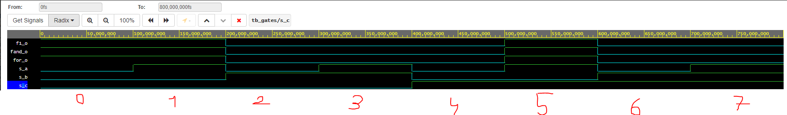
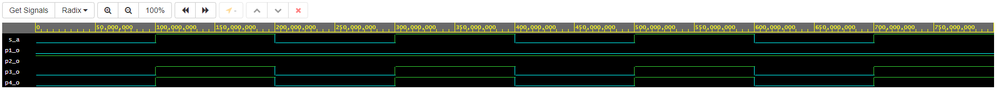
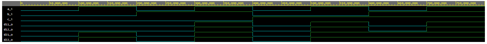

# Digital-electronics-1

## Lab assignment 2)

### Truth table

| **c** | **b** |**a** | **f(c,b,a)** |
| :-: | :-: | :-: | :-: |
| 0 | 0 | 0 | 1 |
| 0 | 0 | 1 | 1 |
| 0 | 1 | 0 | 0 |
| 0 | 1 | 1 | 0 |
| 1 | 0 | 0 | 0 |
| 1 | 0 | 1 | 1 |
| 1 | 1 | 0 | 0 |
| 1 | 1 | 1 | 0 |

### design.vhd

```vhdl
library ieee;               -- Standard library
use ieee.std_logic_1164.all;-- Package for data types and logic operations

------------------------------------------------------------------------
-- Entity declaration for basic gates
------------------------------------------------------------------------
entity gates is
    port(
        a_i    	: in  std_logic;     	-- Data input
        b_i    	: in  std_logic;    	-- Data input
        c_i	   	: in  std_logic;		-- Data input
        
        -- lab 1
        f1_o   	: out std_logic;		-- Fout original
        fand_o 	: out std_logic;		-- F with only AND/NOT
        for_o  	: out std_logic;		-- F with only OR/NOT
        
        -- lab 2 postulates
        p1_o	: out std_logic;		-- x and ~x			= 0
        p2_o	: out std_logic;		-- x or ~x			= 1
        p3_o	: out std_logic;		-- x or x or x		= x
        p4_o	: out std_logic;		-- x and x and x	= x
        
        -- lab 2 distributie law
        -- x and y or x and z = x and (y or z)
        d11_o	: out std_logic;		-- x and y or x and z 
        d12_o	: out std_logic;		-- x and (y or z)
        
        -- (x or y) and (x or z) = x or (y and z)
        d21_o	: out std_logic;		-- (x or y) and (x or z)
        d22_o	: out std_logic			-- x or (y and z)
        
    );
end entity gates;

------------------------------------------------------------------------
-- Architecture body for basic gates
------------------------------------------------------------------------
architecture dataflow of gates is
begin
	f1_o		<= ((not b_i) and a_i) or ((not c_i) and (not b_i));					-- original
	for_o		<= (not (b_i or (not a_i))) or (not (c_i or b_i));						-- or only
	fand_o		<= not ((not ((not b_i) and a_i)) and not ((not c_i) and (not b_i)));	-- and only

	p1_o		<= a_i and (not a_i);
    p2_o		<= a_i or (not a_i);
    p3_o		<= a_i or a_i or a_i;
    p4_o		<= a_i and a_i and a_i;
    
    d11_o		<= (a_i and b_i) or (a_i and c_i);
    d12_o		<= a_i and (b_i or c_i);
    
    d21_o		<= (a_i or b_i) and (a_i or c_i);
    d22_o		<= a_i or (b_i and c_i);
end architecture dataflow;
```

### Waveform
IN:
s_a, s_b, s_c

OUT:
f1_o    -- is the original function given using and/or/not.
for_o   -- is function using only or/not
fand_o  -- is function using only and/not



[link to EDA Playground](https://www.edaplayground.com/x/v9TN)

## Lab assignment 3)

### Boolean postulates waveform

IN:
s_a as variable **x**

OUT:
p1: x and ~x        = 0
p2: x or ~x         = 1
p3: x or x or x     = x
p4: x and x and x	= x




### Distributie laws waveform

IN:
s_a, s_b, s_c as **x**, **y**, **z**

OUT:
d11: x and y or x and z
d12: x and (y or z) 

d21: (x or y) and (x or z)
d22: x or (y and z)

